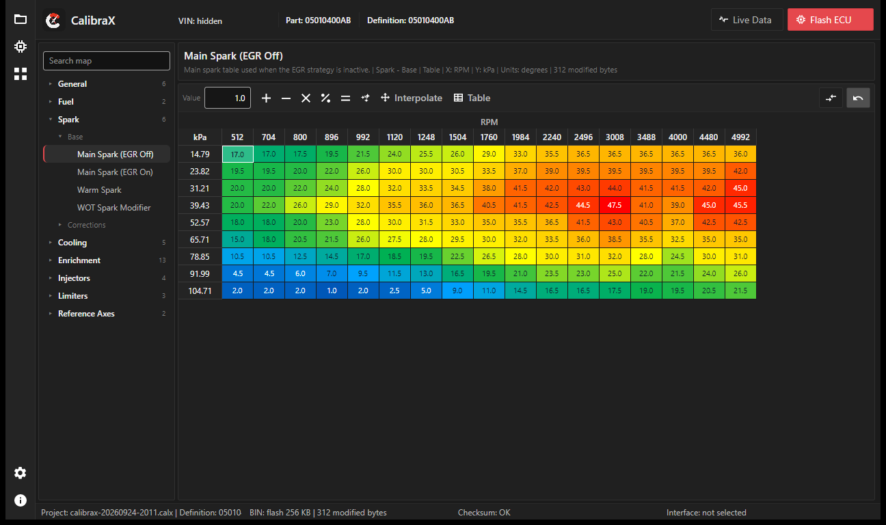

# CalibraX

CalibraX is a Windows desktop application for tuning JTEC engine control units
(ECUs) used in 1996-2004 Chrysler, Jeep, and Dodge vehicles (68HC11-based,
communicating over J2534/SCI). It lets you read and write the ECU's flash memory,
edit calibration tables and scalars with the correct addresses/scales for your
specific part number, compare edits against the original file, undo changes, and
visualize tables as curves or 3D surfaces.

## Features

- **Read ECU flash** over a J2534 pass-thru interface, or open a previously saved
  project file.
- **Table and scalar editors** with correct units, scaling, and axis breakpoints
  per part number — no hand-picked offsets.
- **Compare & Undo** against the original flash image while editing.
- **Curve and 3D surface views** for any table, alongside the standard grid.
- **Live data**: view real-time engine parameters (RPM, MAP, coolant temp, and
  more) while connected to the vehicle.
- **Apps**: extend CalibraX with additional tools that run inside the app — the
  first one available is a byte-level Hex Editor for the flash and other
  captured memory images. 🔒 *some apps require a separate license*
- **Growing vehicle coverage**: support for new part numbers is added regularly.
- **Automatic update check**: the app checks this repository on startup and
  points you to the latest release when one is available.
- **Write ECU flash / checksum repair** 🔒 *requires a license* — see
  [Licensing](#licensing) below.

Everything above except the two marked 🔒 works with no license at all.

## Download

Grab the latest build from the [Releases](../../releases) page. Each release is a
portable, self-contained `.exe` for Windows (win-x86) — no separate .NET runtime
install required. Unzip and run `CalibraX.exe`.

### Windows SmartScreen warning

Windows may show a "Windows protected your PC" prompt the first time you run the
downloaded `.exe`. This is expected: the build isn't signed with a paid code-signing
certificate, so it has no publisher reputation with Microsoft yet. Click **More
info**, then **Run anyway**. You can always verify what you're running by comparing
the file's SHA256 hash against the value shown on the release page, or by reading
the source in the private development repository.

## Licensing

CalibraX is free to download and try: you can open a project, browse calibrations,
and edit tables/scalars without a license. **Writing a checksum-valid flash back to
a real ECU, and some optional apps, require a license**, since a bad checksum can
leave the ECU unable to boot.

To purchase one, contact the developer. You'll receive an additional file to drop
into the app's `definitions` folder that unlocks the licensed feature immediately —
no account, activation server, or restart required.

## Supported interfaces

CalibraX is compatible with J2534 pass-thru devices. Real-world behavior varies
device to device, so here's what's actually been tried:

| Interface           | Status        |
| -------------------- | ------------- |
| Scanmatik 2 Pro (SM2 Pro) | ✅ Validated |
| Autel MaxiFlash / V200    | ⚠️ Untested |
| Tactrix OpenPort 2.0      | ⚠️ Untested |
| Drew Technologies Mongoose Pro | ⚠️ Untested |
| OBDLink MX+ (J2534 mode)  | ⚠️ Untested |

"Untested" doesn't mean unsupported — it means nobody has confirmed it against a
real ECU yet. If you try one of these (or another J2534 device) and it works (or
doesn't), open an issue so this list can be updated.
